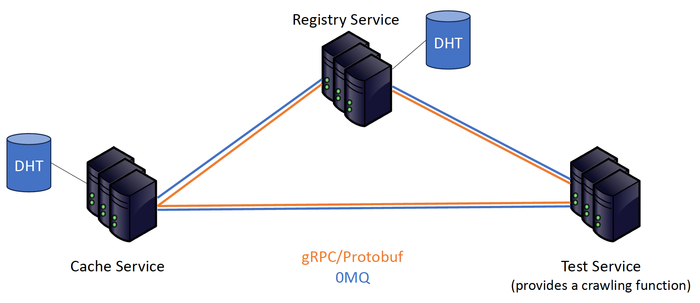

# Distributed Web Crawler & Cache System

A comprehensive distributed, service-oriented system demonstrating key concepts in large-scale distributed computing including Remote Procedure Call (RPC), Service Discovery, Distributed Caching, and Message Queuing.

## 🏗️ System Architecture

The system consists of three core services that work together to form a robust distributed architecture:

### Core Services

- **Registry Service** - Service discovery and health monitoring
  - Manages service registration and discovery
  - Performs health checks every 10 seconds
  - Automatically unregisters failed services after 3 retry attempts
  - Uses Chord Distributed Hash Table for data storage

- **Cache Service** - Distributed in-memory caching
  - Provides distributed key-value storage
  - Implements Chord DHT for data distribution and replication
  - Supports high availability and fault tolerance
  - Integrates with Registry Service for discovery

- **Test Service (Web Crawler)** - Application layer with async capabilities
  - Extracts links from URLs
  - Demonstrates basic distributed application functionality
  - Supports asynchronous message processing via ZeroMQ
  - Provides client-side testing capabilities
  - Integrates with both Registry and Cache services

### Communication Protocols

- **gRPC** - Primary communication between services
- **ZeroMQ** - Asynchronous message queuing (Test Service)
- **Chord DHT** - Distributed hash table for data storage



## 🚀 Quick Start

### Prerequisites

- **Visual Studio Code** with Dev Container extension
- **Docker** (for containerized development environment)
- **Git** (for cloning the repository)

### Development Environment Setup

1. **Clone the repository:**
   ```bash
   git clone git@github.com:TAULargeScaleWorkshop/RLAD.git
   ```

2. **Open in VS Code:**
   - Open VS Code
   - Go to `File → Open Workspace from File...`
   - Select the `large-scale-workshop.code-workspace` file
   - Click `Reopen in Container`

   The project will be mounted at `/workspaces/RLAD/`

   > **⚠️ Important:** Ensure the project folder is named **`RLAD`**. Using any other folder name may cause configuration and file path issues.

### Building the System

1. **Install dependencies and build:**
   ```bash
   ./build.sh
   ```
   
   This script will:
   - Install Python dependencies (beautifulsoup4, requests)
   - Fix OpenJDK configuration
   - Build the Go application
   - Create output directories

2. **Start all services:**
   ```bash
   ./output/start.sh
   ```
   
   This launches:
   - 3 Registry Service instances (1 root + 2 replicas)
   - 3 Cache Service instances (1 root + 2 replicas)  
   - 3 Test Service instances

   Wait for the `"APP READY"` message to confirm all services are running.

## 📁 Project Structure

```
RLAD/
├── config/                 # Configuration definitions
├── services/              # Core service implementations
│   ├── reg-service/       # Registry Service
│   ├── cache-service/     # Cache Service
│   └── test-service/      # Test Service
├── interop/               # Interoperability components
├── utils/                 # Utilities and scripts
├── output/                # Build outputs and logs
├── main.go               # Application entry point
├── build.sh              # Build script
└── README.md             # This file
```

## 🧪 Testing

Each service includes comprehensive unit tests and client-side testing capabilities:

### Running Tests

```bash
# Test Service
cd services/test-service/client/
go test -v

# Cache Service  
cd services/cache-service/client/
go test -v

# Registry Service
cd services/reg-service/client/
go test -v

# Chord DHT Implementation
cd services/reg-service/servant/dht/
go test -v
```

### Test Coverage

- **Service Clients** - Test service communication and API functionality
- **Chord DHT** - Test distributed hash table operations
- **Integration Tests** - Test inter-service communication
- **Async Message Processing** - Test ZeroMQ integration

## 🔧 Configuration

Services are configured using YAML files located in `services/{service-name}/service/`:

### Example Configurations

**Registry Service Root:**
```yaml
type: "RegService"
listen_port: 8502
name: root
```

**Cache Service:**
```yaml
type: "CacheService"
registry_addresses:
  - "127.0.0.1:8502"
  - "127.0.0.1:8503"
  - "127.0.0.1:8504"
name: root
```

## 📊 Monitoring and Logs

- **Logs Location:** `./output/logs/`
- **Service Health:** Registry Service monitors all services every 10 seconds
- **Process Management:** Use `ps -ao pid= | xargs kill` to stop all instances

## 🛠️ Development

### Adding New Services

1. Create service directory in `services/`
2. Implement service interface
3. Add configuration YAML
4. Update `main.go` switch statement
5. Add to `start.sh` script

### Key Technologies

- **Go 1.22.2** - Primary language
- **gRPC** - Service communication
- **ZeroMQ** - Message queuing
- **Chord DHT** - Distributed storage
- **YAML** - Configuration
- **MetaFFI** - Language interoperability

## 🐛 Troubleshooting

### Common Issues

1. **Build Failures:**
   - Ensure you're in the Dev Container environment
   - Check that the folder is named `RLAD`
   - Verify Docker is running

2. **Service Startup Issues:**
   - Check logs in `./output/logs/`
   - Ensure ports are available
   - Verify configuration files

3. **Network Issues:**
   - Check service discovery via Registry Service
   - Verify gRPC connections
   - Ensure ZeroMQ ports are accessible

### Debug Commands

```bash
# Check running processes
ps aux | grep large-scale-workshop

# View service logs
tail -f ./output/logs/RegService1_root.log

# Kill all services
ps -ao pid= | xargs kill

# Check port usage
netstat -tulpn | grep :850
```

## 📚 Additional Resources

- **Chord DHT Paper:** [Chord: A Scalable Peer-to-peer Lookup Service](https://pdos.csail.mit.edu/papers/chord:sigcomm01/chord_sigcomm.pdf)
- **gRPC Documentation:** [grpc.io](https://grpc.io/docs/)
- **ZeroMQ Guide:** [zeromq.org](https://zeromq.org/get-started/)

**Important:**
Please ensure that the project folder is named **`RLAD`**. Using any other folder name may cause issues with the system's configuration and file paths.

## Usage

### Building
In the root directory run `./build.sh` to install required dependencies and build the app to `./output`.

### Running
Run the app using `./output/start.sh` to start 3 services of each type: Registry, Cache and Test. 

---

**Note:** This system is designed for educational purposes and demonstrates key concepts in distributed systems. For production use, additional considerations for security, monitoring, and scalability would be required.